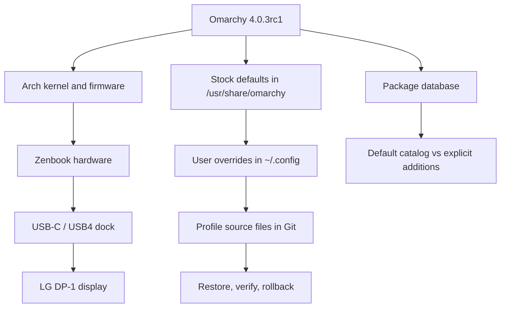

# System wiki

This is the connected map of the current machine. Read it from the top when
you need to understand how the laptop, Omarchy, packages, user overrides and
external devices work together. The profile files remain the source of truth
for restoration; this wiki explains the relationships and the differences
from the Omarchy defaults.

## Start with a question

| Question | Page |
|---|---|
| What exactly is installed today? | [System](system.md) |
| What hardware and IDs are connected? | [Hardware overview](hardware.md) |
| How does the display path work? | [Display](components/display.md) |
| What is the dock doing? | [Dock and USB](components/dock-usb.md) |
| What differs from stock Omarchy? | [Configuration layers](software/configuration.md) |
| Which packages are default, added or missing? | [Packages](software/packages.md) and [full inventory](software/package-inventory.md) |
| How do CPU, GPU and NPU work together? | [Compute](components/compute.md) |
| How do storage and encryption work? | [Storage](components/storage.md) |
| How do Wi-Fi, Bluetooth and Ethernet work? | [Network](components/network.md) |
| How do audio, camera and input work? | [Media and input](components/media-input.md) |
| How do I restore or test safely? | [Operations](operations/README.md) |

## Evidence rules

Every claim has one of four meanings:

- **observed** — read from this host or reproduced in a protected test;
- **profile** — declared by this repository and intended to be restored;
- **stock** — supplied by the installed Omarchy release;
- **open** — not measured yet, or dependent on hardware/firmware behavior.

The current machine record is [Zenbook hardware](zenbook/hardware.md). The file-level restore map is
[Zenbook configuration](zenbook/configuration.md).
Detailed experiment reports live in the [evidence index](evidence/README.md), while raw runs remain local and ignored.

## Current boundary

The machine is running Omarchy `4.0.3rc1-2` with the `quattro` generation of
the Omarchy layout. Omarchy's stock files live under `/usr/share/omarchy`;
the maintained user layer lives under `~/.config`, as described in the
[Omarchy dotfiles manual](https://github.com/omacom/omarchy/blob/quattro/manual/31-dotfiles.md).
The profile never treats stock files as writable configuration.
